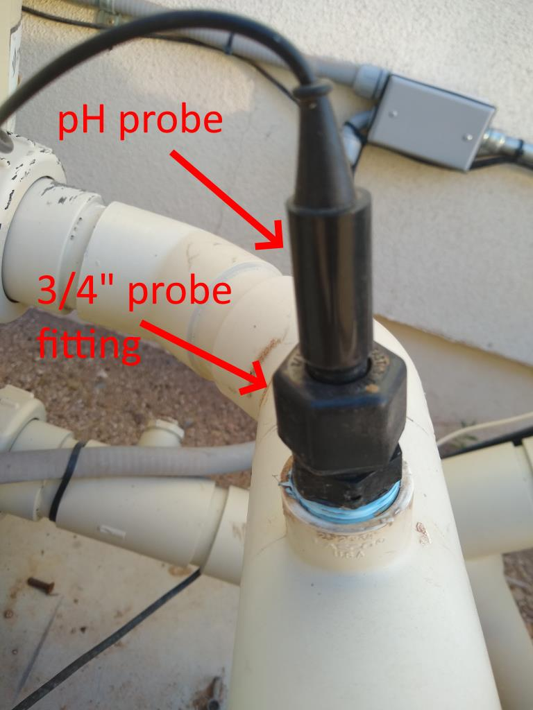

# Reading pH off a Pool #
Here is how I get the pH off my pool.  This is just for illustration purposes and do at your own risk; you can easily kill yourself or get seriously injured by an exploding filter, electrocution, or other manner.  So stay in your lane and hire professionals where warranted.

### Bill of Materials:

1> Probe fitting - https://bit.ly/2L9EyIg
2> pH Probe - https://ebay.to/2WUVSmh
3> EZO Carrier Board https://bit.ly/2L85Ezq
4> EZO-pH pH Circuit https://bit.ly/2GVhreE
5> A Raspberry Pi https://amzn.to/2X2HWXK
6> git clone https://github.com/krk628/Raspberry-Pi-sample-code /phsensor
7> Calibration Solution - https://amzn.to/2N4CmEh

### PHYSICAL CONNECTIONS:

* The probe fitting (#1) screws into a 3/4" NPT PVC socket and gives you a watertight connection for your pH probe to go into.  My pool company already put a 3/4" socket with a hose bib on my pool for draining purposes; so for me I just shut off the pool, unscrewed the hose bib, and plugged the fitting right in.
* It'll probably vary for anyone else.  pH probes should never be dry so this was the perfect place as my probe is sitting in water 100% of the time.  I have it pushed all the way in...all the way down against the inside of the PVC.

* With the fitting and probe installed you can bring your pool back to service.

* The probe's BNC cable gets plugged into the carrier (#3).

* The carrier (#3) is a daughter card that sits on top of the EZO circuit (#4).

* The EZO (#4) gets plugged into the UART pins on the Raspberry Pi (#5)

* I put the Raspberry Pi (#5) n an electrical box near the probe.  It'll vary for others, but the Pi + Carrier EZO is all going to be close to the BNC cable coming off your probe (#2).  I also wired the Pi's DC power into a 5V AC/DC power supply and put that on a circuit in my Easytouch panel so I could reset the Pi if necessary. 

### BASIC SOFTWARE INTEGRATION:

* I installed Raspian on a Pi Zero W (or whatever works for you w/GPIO pins) and got it only my home network.

* When you are on the network you can clone the repository in #6 into /phsensor.  From there it's only a couple mods to some python to make the "uart.py" script spit out the pH to the terminal (I'll fork the repo above so you can see how I did it).

### BONUS - HOME ASSISTANT INTEGRATION:

* Make sure you have the script on the phsensor Raspberry Pi outputting the pH to the terminal as above.

* Setup your main HA server so that the user that runs HA can ssh as root to your new Pi that's reading the pH.  Assuming your Home Assitant user is "ha" and your phsensor is at 192.168.10.55, that process might go like this...

    ssh-keygen
    scp ~/.ssh/id_rsa.pub root@192.168.10.55:/root/authorized_keys

  
From there your HA account will be able to login as root without a password.  Test like this from your Home Assistant server:

      ssh root@192.168.10.55

  
If you get onto the new Raspberry Pi without prompting you are set.

* Finally, this input_number gives you your pool's pH every minute:

    input_number:
      - platform: command_line
        name: pool_ph2
        command: /usr/bin/ssh root@192.168.10.55 /phsensor/uart.py | head -n +1

Here is how the 3/4" fitting and probe are implemented on my pool...

